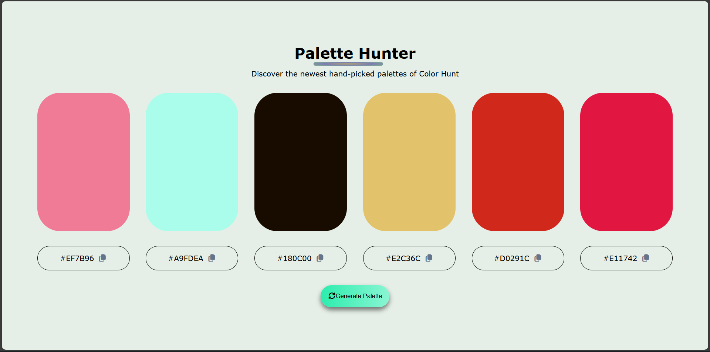
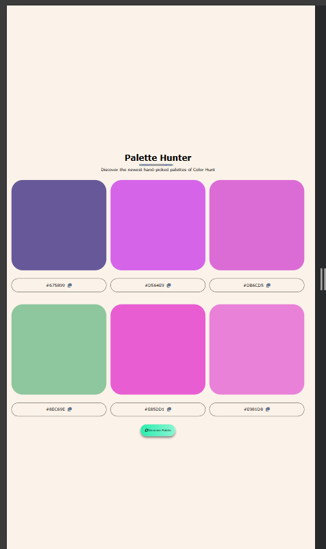

- [Overview](#overview)
  - [The challenge](#the-challenge)
  - [Screenshot](#screenshot)
  - [Links](#links)
- [My process](#my-process)
  - [Built with](#built-with)
  - [What I learned](#what-i-learned)
- [Author](#author)

# **Overview**
This is a **Colour Palette Generator** project done using HTML, CSS and JS. I found HTML and CSS to be relatively straightforward, but JavaScript was especially challenging when it came to applying concepts like arrays, functions, and loops. Copying the colour code using JavaScript was a challenge. But overall, I got the job done.

# **Screenshot**

# **Built with**
HTML
CSS
JS

# **What I learned**
I learn about the copy API for the first time in JS without using external libraries.

# **Author**
Emmanuel Akwaboah
